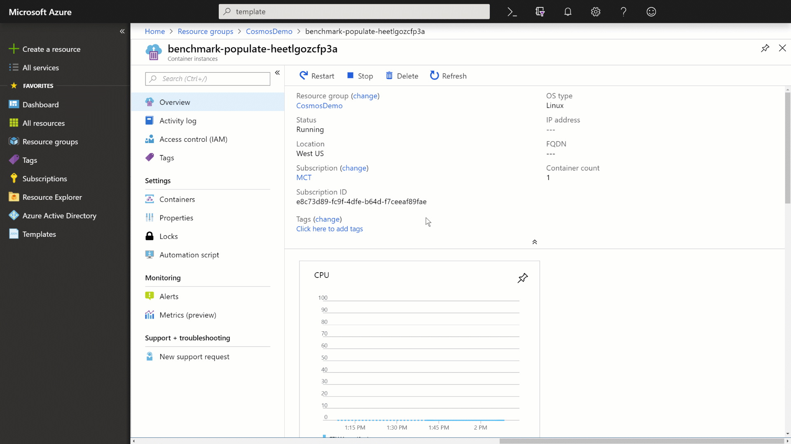
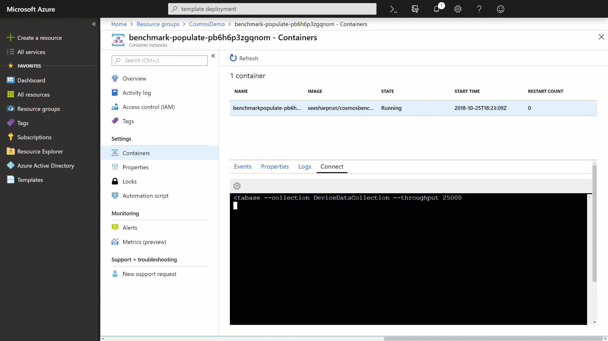
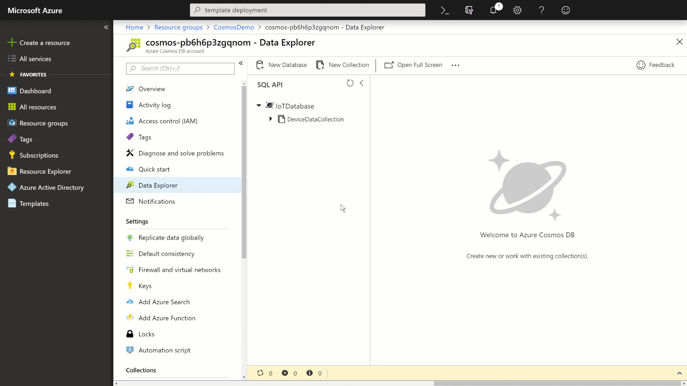
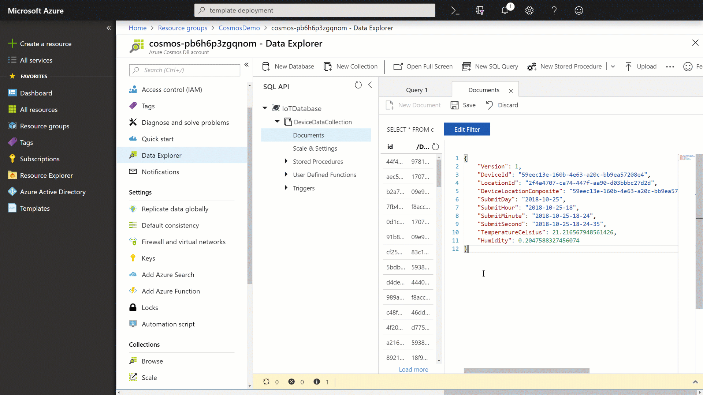

>  
> [Azure Cosmos DB](https://docs.microsoft.com/azure/cosmos-db/)

# Scaling, performance, and flexibility in Azure Cosmos DB

This demo script will help you demonstrate Azure Cosmos DB to an audience. The script comprises of a single Setup section that should be followed prior to starting the demo and three demo sections for each of the categories that will be demoed: "Scalability", "Performance", and "Flexibility".

===

# Demo setup

This section should be completed prior to starting the demo. In this section, you will deploy the following resources:

- Azure Cosmos DB account in West US region
- Azure Container Instance in West US region
    - This instance will be used to initially seed and populate the database
- Azure Container Instances in Southeast Asia, North Europe, and West US regions
    - These instances will be used to test global performance of the account

Throughout this setup section, we will share animated images that will help you navigate the Azure portal and learn where specific features are located. The instructions in the remaining sections will use the same features in the portal so it is recommended to repeat the setup multiple times if you are unfamiliar with the Azure Cosmos DB experience in the portal.

## Step-by-step instructions

1. To get started, you must first deploy an [ARM template](azuredeploy.json) that will deploy all of those resources and correctly configure them.

    > If you are using LODS as your demo environment, this ARM template will already have been deployed for you. There is no need to deploy the template a second time.

    For ease, you can click the link below to deploy your ARM template:

    [](https://portal.azure.com/#create/Microsoft.Template/uri/https%3A%2F%2Fraw.githubusercontent.com%2Fseesharprun%2Fcosmos-demo%2Fmaster%2Fazuredeploy.json)

    > A typicaly deployment takes approximately ten minutes.

1. Once your environment is deployed, you can observe the Azure Cosmos DB account in your Azure subscription:

    

    > The name of your resource group may differ from the screenshots.

1. Go to your resource group, locate and select the **Azure Container Instance** with **-populate-* in the name:

    

1. In the **Settings** section of the container instance, select the **Containers** option to view your currently running container.

    

1. Within the container, run the following command to populate your Azure Cosmos DB instance:

    ```
    ./cosmosbenchmark --location westus --type populate --database IoTDatabase --collection DeviceDataCollection --throughput 25000
    ```

1. Observe the output from the container application as it populates your Azure Cosmos DB instance with data.

    

1. Wait for the benchmark application to finish processing.

1. Navigate back to the Azure Cosmos DB instance.

1. Select the **Data Explorer** option to view your newly created database and collection.

    

1. In the Data Explorer, select the **DeviceDataCollection** collection and then click the **New SQL Query** button.

    

1. In the **New SQL Query** window, enter the following SQL command:

    ```
    SELECT * FROM data
    ```

1. Press the **Execute** button to issue the query and observe the query results.

    

1. Enter and execute the following command:

    ```
    SELECT COUNT(1) FROM data
    ```

1. Click the **Documents** link under the **DeviceDataCollection** node and then click the **New Document** button.

    

1. In the document editor, enter the following JSON content:

    ```
    {
        "Version": 1,
        "DeviceId": "59eec13e-160b-4e63-a20c-bb9ea57208e4",
        "LocationId": "2f4a4707-ca74-447f-aa90-d03bbbc27d2d",
        "DeviceLocationComposite": "59eec13e-160b-4e63-a20c-bb9ea57208e4_2f4a4707-ca74-447f-aa90-d03bbbc27d2d",
        "SubmitDay": "2018-10-25",
        "SubmitHour": "2018-10-25-18",
        "SubmitMinute": "2018-10-25-18-24",
        "SubmitSecond": "2018-10-25-18-24-35",
        "TemperatureCelsius": 21.216567948561426,
        "Humidity": 0.2047588327456074
    }
    ```

1. Click the **Save** button to persist the document and then observe the newly created document.

    

===

# Scalability and elasticity with Azure Cosmos DB

For the first demo, we will compare write performance at two different throughput levels. We will start with a low throughput level (10K-50K range) and then test writes using a higher throughput level (100K+ range).

## Step-by-step instructions

1. To start, we will go into the Azure Cosmos DB account. This can be accomplished by clicking on the **Resource Groups** link in the Azure portal, selecting your previously created group and then selecting the sole **Azure Cosmos DB** resource:

    

1.

===

# Azure Cosmos DB Performance


## Step-by-step instructions

1. 

===

# Document Flexibility using Azure Cosmos DB


## Step-by-step instructions

1. 

===